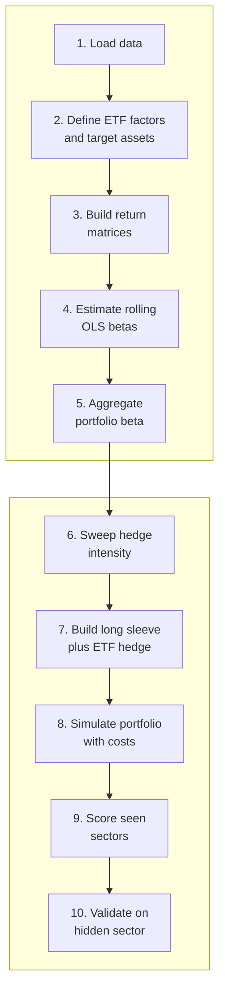

# Sortino Capital

Sortino Capital delivers quantitative financial research and intelligence on a global scale to individual private capital, wealth managers, and family offices. We provide both the all-weather investment signals and the systematic financial technologies required to modernize portfolio construction, risk management, and investor relations. 

You can follow us at https://sortino.capital/

# Alpha Hedging Challenge

This competition challenges quantitative analysts/engineers to develop an institutional-grade, sector-neutral systematic strategy. Rather than rewarding unhedged leverage, factor betting, or parameter curve-fitting, this framework enforces strict capital velocity, risk limits, and structural generalization across an entirely unseen economic sector.

> Disclaimer: The model in this repository is only a sample workflow and includes important simplifications that materially affect the results, especially with respect to transaction costs and other modeling assumptions.

---

## Competition Format
The competition has two stages:
1. **Code Submission:** Participants submit their strategy through the required repository-based submission process described below.
2. **Finalist Presentation:** The top 2 candidates will be invited to present their approach virtually in a live session.

Eligibility requirement:
Participants must reside outside the United States.

Team format:
Participants may compete individually or in teams of up to 2 members.

---

## 1. Core Objective & Architecture
Candidates must develop a single, regime-agnostic Python strategy class. The class must dynamically accept any arbitrary sector ETF along with its underlying stock universe, initialize capital configurations on the fly, and execute intra-sector long/short hedging portfolios. 

The baseline model provided in this repository utilizes a multi-factor rolling Ordinary Least Squares (OLS) regression matrix to isolate sector beta. Your objective is to optimize this framework, or engineer a superior asset-pricing pipeline, to maximize downstream risk-adjusted performance. Your model will be developed on three historical training sectors and deployed blindly by our validation engine to a **completely hidden, out-of-sample sector** over a 10-year historical testing window.

### Baseline Model Workflow

---

## 2. Sector Universe & Data Parameters
Historical data is programmatically fetched via `yfinance` spanning a **10-year historical horizon** at a **Daily frequency (`interval="1d"`)**. 

> ⚠️ **Important:** To account for corporate actions, split events, and heavy dividend yield payouts across banking and energy sectors, your portfolio simulation and signal generation **must** calculate Net Asset Value (NAV) using the **`Adj Close`** pricing matrix.

| Target Industry Block | Eligible Equity Universe (Long-Only Candidates) | Mandatory Benchmark ETF (Short Vehicle) |
| :--- | :--- | :--- |
| **Technology / Semiconductor** | `NVDA`, `AMD`, `INTC`, `AVGO`, `QCOM`, `TSM`, `ASML`, `MU` | `SOXX` (iShares Semiconductor ETF) |
| **Financial / Banking** | `JPM`, `BAC`, `MS`, `GS`, `C`, `WFC`, `PNC`, `USB` | `XLF` (Financial Select Sector SPDR) |
| **Energy / Infrastructure** | `XOM`, `CVX`, `COP`, `SLB`, `EOG`, `MPC`, `VLO`, `DVN` | `XLE` (Energy Select Sector SPDR) |
| **Healthcare / Biotech (OOS Blind)** | `LLY`, `UNH`, `JNJ`, `ABBV`, `MRK`, `AMGN`, `PFE`, `BMY` | `XLV` (Health Care Select Sector SPDR) |

---

## 3. Structural Portfolio Mandates & Guardrails
These rules are continuous structural constraints evaluated on daily bars. Breaches at any single row index checkpoint will trigger automated validation failure and immediate strategy disqualification.

* **Revolving Capital Minimum (Active Deployment):** Your portfolio must maintain a minimum average Gross Exposure ($`\frac{\text{Long Exposure} + |\text{Short Exposure}|}{\text{NAV}}`$) at or above **50% of NAV** across the full evaluation timeline. Here, **Long Exposure** is the total dollar value of all long positions, **Short Exposure** is the total dollar value of all short positions, $`|\text{Short Exposure}|`$ uses the absolute value so the short book is counted as positive size, and **NAV** is the portfolio Net Asset Value. Strategies cannot retreat to cash to lock in or freeze a lucky yield spike.
* **The No-Idling Position Rule:** To prevent placing microscopic "token" trades to manipulate transaction metrics, any newly initialized stock/ETF pair basket must allocate a **minimum of 5% and a maximum of 25% of current NAV** at the exact timestamp of entry.
* **Minimum Holding Window:** Once a stock/ETF pair structure is initialized, both positions are locked and cannot be modified or liquidated until **day $`T+5`$** (5 consecutive trading days later), where $`T`$ is the trade entry day.
* **Forced Terminal Settlement:** Your script must completely purge its order books and flatten all open asset inventories back to cash (USD) on the final day bar of the competition window. **Zero open exposure or trailing inventory is allowed at terminal close.**
* **Leverage Ceiling:** Absolute gross portfolio leverage may **never exceed 20:1** on any daily checkpoint.

---

## 4. Evaluation Framework & Multi-Objective Scoring
The evaluation suite runs your unaltered script across the data environments to calculate daily log returns ($`r_t = \ln(\text{NAV}_t / \text{NAV}_{t-1})`$), inclusive of execution friction, short borrow costs, and position slippage penalties. In this notation, $`r_t`$ is the log return on day $`t`$, $`\text{NAV}_t`$ is portfolio Net Asset Value on day $`t`$, $`\text{NAV}_{t-1}`$ is the prior day's Net Asset Value, and $`\ln`$ is the natural logarithm. Your **Global Performance Score ($`S_{\text{Global}}`$)** is compiled via three core pillars:

$$S_{\text{Global}} = 0.50 \cdot S_R + 0.30 \cdot S_{\text{Gen}} + 0.20 \cdot S_E$$

Here, $`S_{\text{Global}}`$ is the final overall score, $`S_R`$ is the asymmetric risk-adjusted return score, $`S_{\text{Gen}}`$ is the structural generalization score, and $`S_E`$ is the capital-efficiency score.

### Pillar 1: Asymmetric Risk-Adjusted Return (50% Weight)
Rewards strategies that optimize the annualized Sortino Ratio while minimizing Maximum Drawdown ($`\text{MDD}`$) across all sectors combined. The Minimum Acceptable Return ($`\text{MAR}`$) is standardized to 0. Here, **MDD** is the largest peak-to-trough decline in NAV over the evaluation window, and **MAR** is the return threshold below which returns count as downside risk.

$$\text{Sortino Ratio} = \frac{R_p}{\sigma_d}$$

In this equation, $`R_p`$ is the portfolio's annualized return and $`\sigma_d`$ is the annualized downside deviation.

$$R_p = \left( \prod_{t=1}^{N} (1 + r_t) \right)^{\frac{252}{N}} - 1$$

Here, $`N`$ is the total number of observed trading days, $`r_t`$ is the daily log return at time $`t`$, and 252 is the standard approximation for the number of trading days in one year.

$$\sigma_d = \sqrt{\frac{252}{N} \sum_{t=1}^{N} \min(0, r_t)^2}$$

In this expression, $`\sigma_d`$ measures only downside volatility, and $`\min(0, r_t)`$ keeps negative returns while replacing positive returns with zero so only harmful deviations are penalized.

$$S_R = \text{Sortino} \times (1 - \text{MDD})$$

Here, $`S_R`$ is the risk-adjusted return pillar score, **Sortino** is the Sortino Ratio defined above, and **MDD** is expressed as a decimal drawdown fraction.

### Pillar 2: Structural Generalization Index (30% Weight)
Measures the performance degradation ratio when your model is forced to trade an asset class it has never encountered during training. 

$$S_{\text{Gen}} = \frac{\text{Sortino}_{\text{Unseen (XLV)}}}{\text{Sortino}_{\text{Seen (SOXX, XLF, XLE)}}}$$

Here, $`S_{\text{Gen}}`$ compares the Sortino Ratio achieved on the hidden out-of-sample healthcare sector ETF universe (**XLV**) with the Sortino Ratio achieved on the seen training-sector ETF universes (**SOXX**, **XLF**, and **XLE**). A value near 1 indicates similar performance on unseen and seen sectors, while a lower value indicates weaker generalization.

### Pillar 3: Capital & Leverage Efficiency (20% Weight)
Rewards strategies that generate superior risk-adjusted alpha using capital efficiency rather than brute-force margin amplification. Instead of taking an easily manipulated average, the suite monitors peak leverage stress using the 95th percentile checkpoint.

$$S_E = \text{Sortino} \times \left(1 - \frac{\text{95th Percentile Gross Leverage Used}}{20}\right)$$

Here, $`S_E`$ is the capital-efficiency pillar score, **Sortino** is the Sortino Ratio, **95th Percentile Gross Leverage Used** is the leverage level exceeded on only 5% of checkpoints, and 20 is the maximum permitted gross leverage from the challenge's **20:1** leverage ceiling.

---

## 5. Guidance Note for Advanced Candidates
The baseline pipeline provided in `2_model.ipynb` uses standard rolling OLS (`np.linalg.lstsq`) to isolate sector beta. While functional, OLS is highly vulnerable to noise and multicollinearity during macro shocks. 

To secure a top position on the Sortino Capital Leaderboard, advanced candidates should explore:
1. **Regularized and State-Space Estimators:** Implementing Ridge/Lasso constraints, robust M-estimators, or rolling Kalman Filters to generate cleaner, less volatile tracking Betas.
2. **Dynamic Portfolio Optimization:** Replacing the baseline equal-weight asset assignment with modern structural allocators (e.g., Hierarchical Risk Parity or Volatility Targeting) to optimize the long-only equity sleeve.
3. **Statistical Integrity:** Programmatically validating the mean-reverting properties of the residual spreads before capital deployment.

---

## 6. Script Submission Protocol
Submit a **public GitHub repository link** plus the exact **commit hash, tag, or release** to evaluate.

Your repository should make it easy for the evaluator to change the hidden sector and rerun the full workflow without modifying your code.

Include the following:
1. One production strategy file for evaluation.
2. A short README that says exactly which file to run and how to install dependencies.
3. A dependency file such as `requirements.txt` or `pyproject.toml`.
4. Any research notebooks you want to share. These notebooks must be well commented and explain the reasoning behind the research steps, modeling choices, and conclusions.

Evaluation rules:
1. The evaluator must be able to identify the submission file immediately.
2. The code must run after normal environment setup, without manual fixes or special instructions.
3. The code must use the same data-loading method and input structure as the competition pipeline, so the evaluator can swap the hidden sector and rerun everything unchanged.
4. The repository must remain public during the review period.
5. Notebooks are supporting material only. Evaluation is based on the designated production strategy file.